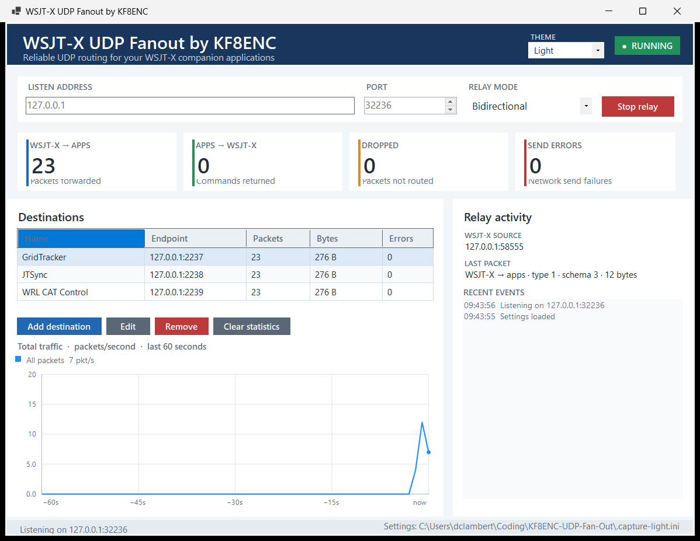
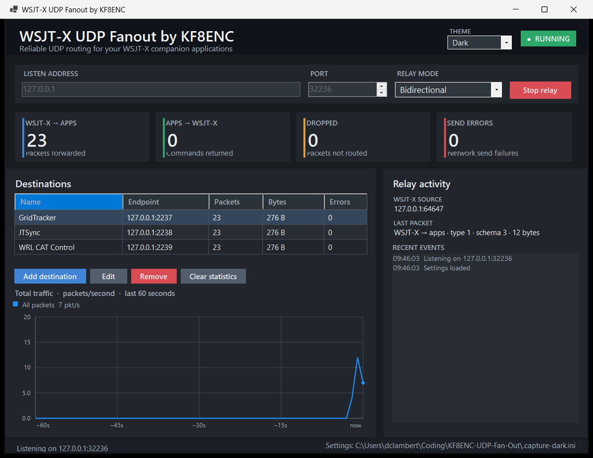
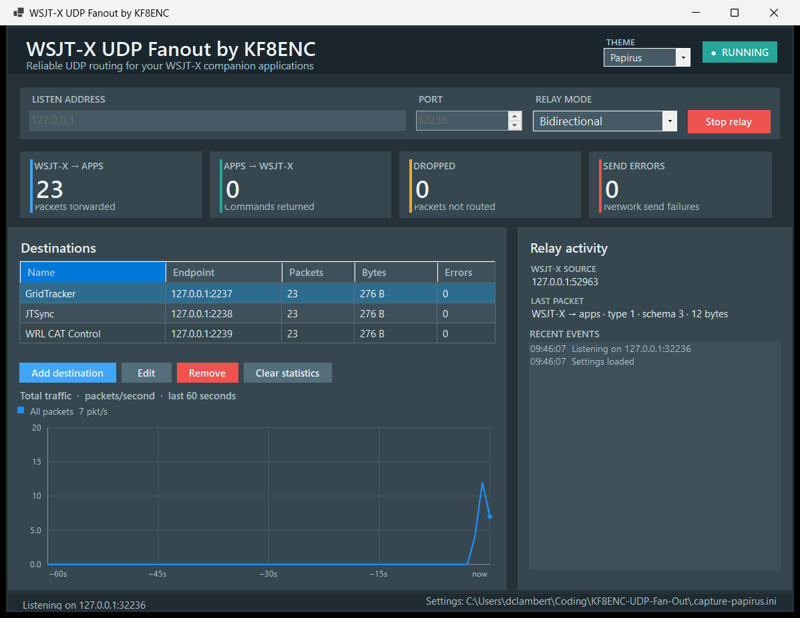
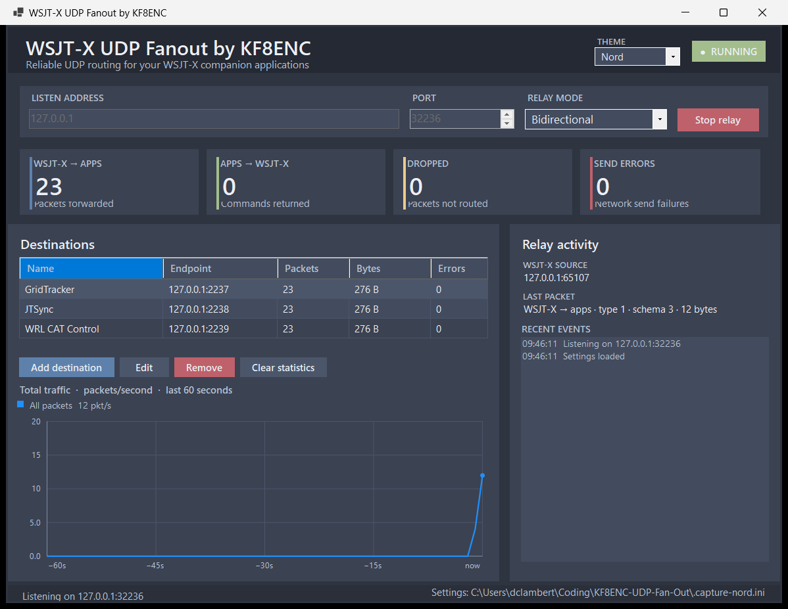
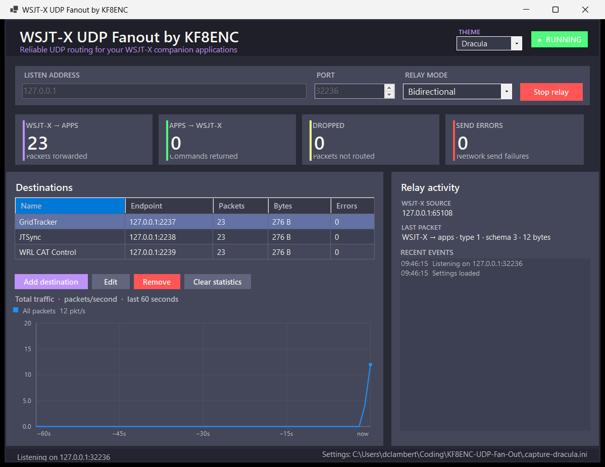
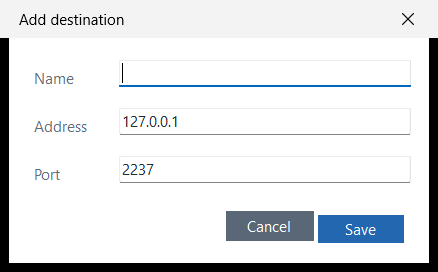

# WSJT-X UDP Fanout

Windows desktop UDP relay for WSJT-X companion programs.

Default flow:

```text
WSJT-X -> 127.0.0.1:2236 -> WsjtxUdpFanout.exe
                              -> GridTracker       127.0.0.1:2237
                              -> JTSync            127.0.0.1:2238
                              -> WRL CAT Control   127.0.0.1:2239
```

The relay is bidirectional by default. It learns the WSJT-X UDP source socket from WSJT-X traffic, then relays companion-app command packets back to WSJT-X.

## Download Options

Choose the interface that best fits your setup:

- [Windows GUI v2.3.0 installer](downloads/WsjtxUdpFanout-Windows-GUI-v2.3.0-Setup.exe) — Recommended. Standard Windows dashboard with destination management, live statistics, selectable themes, and no command-prompt window.
- [Console v1.3 installer](downloads/WsjtxUdpFanout-Console-v1.3.0-Setup.exe) — Original command-prompt dashboard with typed management commands.

Both installers are self-contained 64-bit Windows packages; the destination computer does not need the .NET runtime installed.

## WSJT-X Setup

In WSJT-X:

```text
File -> Settings -> Reporting
UDP Server address: 127.0.0.1
UDP Server port:    2236
Accept UDP requests: checked
```

`Accept UDP requests` is required if a companion app sends commands back to WSJT-X.

## Windows GUI Application

The application opens as a standard Windows desktop window—there is no command prompt. From the dashboard you can:

- Start and stop the relay.
- Switch between bidirectional and read-only modes.
- Add, edit, or remove companion-app destinations.
- Monitor packet counts, errors, the learned WSJT-X source, and recent events.
- Monitor all relay traffic on a single blue 60-second packets-per-second line graph.
- Choose Light (default), Dark, Papirus, Nord, or Dracula from the Theme menu.
- Clear traffic statistics.

Destination, listener, and theme changes are saved automatically.

### Dashboard


### Themes

Use the Theme menu to switch the entire dashboard instantly. The selected theme is remembered for the next launch.

| Light (default) | Dark |
| --- | --- |
|  |  |
| Papirus | Nord |
|  |  |
| Dracula | |
|  | |

### Destination Editor



Changes are saved to:

```text
%APPDATA%\WsjtxUdpFanout\WsjtxUdpFanout.ini
```

## Build

Install the .NET 8 SDK, then run:

```bat
Build_Windows_DotNet.bat
```

The direct .NET command is:

```bat
dotnet publish WsjtxUdpFanout.csproj --configuration Release --runtime win-x64 --self-contained true --output publish -p:PublishSingleFile=true
```

This creates the current Windows GUI as a self-contained, single-file executable at:

```text
publish\WsjtxUdpFanout.exe
```

## Installer

Install the .NET 8 SDK and Inno Setup 6, then run:

```bat
Build_Installer_Inno.bat
```

The installer will be written to:

```text
installer\WsjtxUdpFanoutSetup.exe
```

Release-ready installer copies are kept in the [`downloads`](downloads/) directory with the interface and version in each filename.
